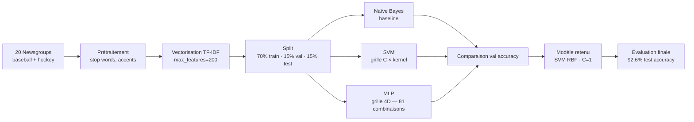
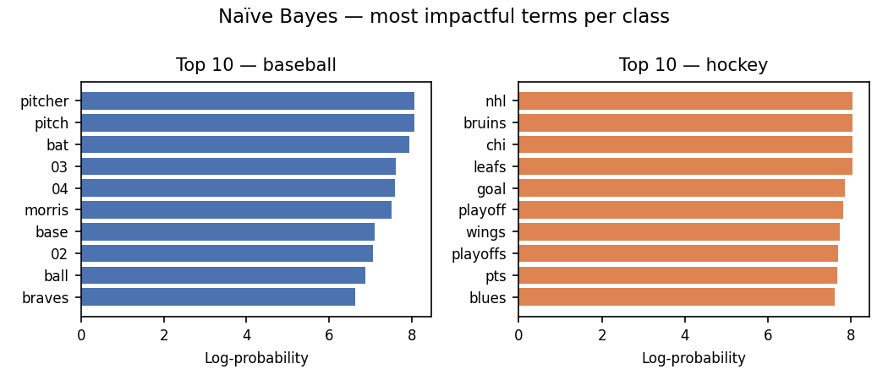
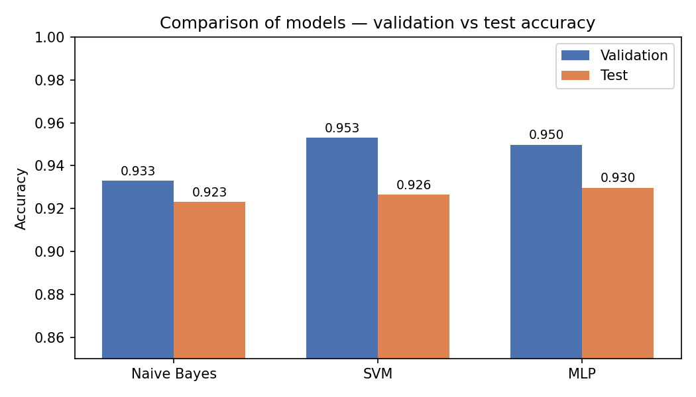
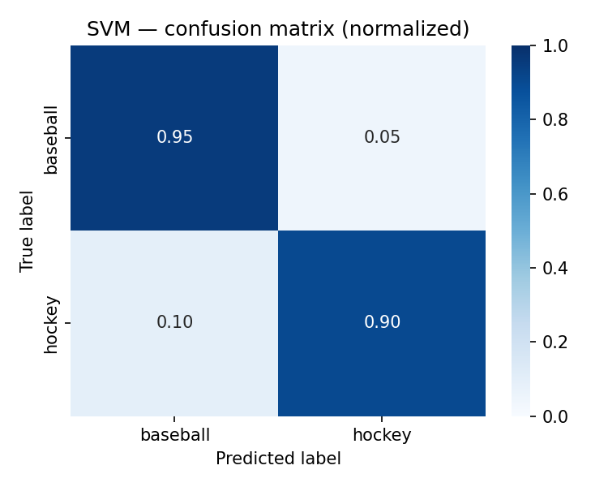
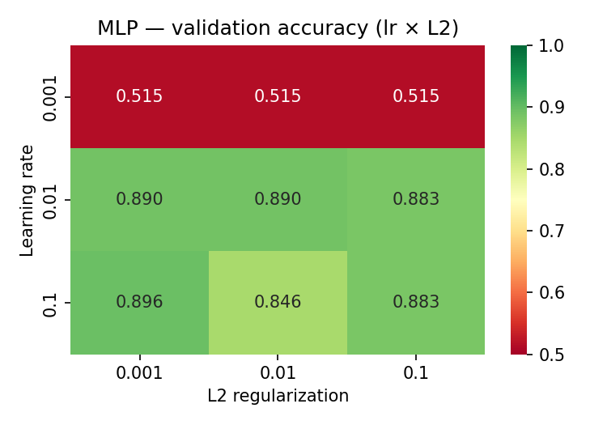

# Classification de texte sur TF-IDF — SVM 92.6% test accuracy


Classification binaire de articles de presse sportive (baseball vs hockey) à partir de représentations TF-IDF. Trois modèles comparés — Naïve Bayes, SVM et réseau de neurones MLP — avec recherche exhaustive d'hyperparamètres. **SVM avec kernel RBF atteint 92.6% d'accuracy sur le test.**

---

## Stack technique

| Catégorie | Outils |
|-----------|--------|
| Langage | Python 3.10 |
| Modélisation ML | scikit-learn — `MultinomialNB`, `SVC`, `MLPClassifier` |
| Représentation texte | `TfidfVectorizer` (scikit-learn) |
| Sélection de modèle | Recherche sur grille, validation croisée, `accuracy_score` |
| Visualisation | Matplotlib, Seaborn — heatmaps, courbes de sensibilité |
| Données | `fetch_20newsgroups` (scikit-learn) |
| Versioning | Git, GitHub |

---

## Architecture de la pipeline



---

## Problème résolu

Peut-on distinguer automatiquement des articles de presse sur le baseball de ceux sur le hockey à partir de leur seul contenu textuel, sans aucune annotation manuelle ? Et parmi trois familles de modèles, laquelle offre le meilleur compromis performance / complexité ?

La réponse est contre-intuitive : un réseau de neurones avec une seule couche cachée de 4 neurones ne surpasse pas un SVM classique, et Naïve Bayes — malgré ses hypothèses simplistes — atteint déjà 93.3% en validation.

---

## Données

Le projet utilise le dataset **20 Newsgroups** de scikit-learn, restreint aux deux catégories `rec.sport.baseball` et `rec.sport.hockey`. C'est un corpus de référence en traitement automatique du langage, composé d'articles de forums de discussion datant des années 1990.

Les données sont divisées avec `random_state=42` en trois ensembles : 70% pour l'entraînement, 15% pour la validation et 15% pour le test. Chaque article est représenté par un vecteur TF-IDF de 200 dimensions — les 200 termes les plus fréquents du corpus, pondérés par leur rareté (paramètres : `decode_error="replace"`, `strip_accents="unicode"`, `stop_words="english"`).

Le dataset est entièrement public et se charge automatiquement via scikit-learn :

```python
from sklearn.datasets import fetch_20newsgroups
data = fetch_20newsgroups(
    subset="all",
    categories=["rec.sport.baseball", "rec.sport.hockey"],
    random_state=42
)
```

Les 10 termes ayant le plus d'impact selon le modèle Naïve Bayes par classe : 


---

## Méthodologie

La comparaison suit une progression logique : baseline simple → modèle linéaire à noyau → réseau de neurones. Chaque modèle est entraîné sur le train, sélectionné sur la validation, et évalué une seule fois sur le test.

**Naïve Bayes** sert de référence probabiliste. Malgré l'hypothèse d'indépendance entre les mots — irréaliste en langage naturel — il se révèle compétitif sur TF-IDF.

**SVM** explore une grille de 9 combinaisons : régularisation C ∈ {0.1, 1, 10} croisée avec trois noyaux {linear, rbf, poly}. Le noyau RBF transforme implicitement les données vers un espace de dimension supérieure pour trouver une frontière de séparation à marge maximale.

**MLP** fait l'objet d'une recherche exhaustive sur 81 combinaisons d'hyperparamètres, couvrant la taille des deux couches cachées {4, 8, 16} × {0, 4, 8}, le learning rate {0.001, 0.01, 0.1} et la régularisation L2 {0.001, 0.01, 0.1}. `early_stopping=True` prévient le surapprentissage. `random_state=12345` garantit la reproductibilité.

---

## Résultats

| Modèle | Paramètres retenus | Val. Accuracy | Test Accuracy |
|--------|--------------------|--------------|---------------|
| Naïve Bayes | — | 93.31% | — |
| **SVM** | **C=1, kernel RBF** | **95.32%** | **92.64%** ✅ |
| MLP | 4 neurones, lr=0.1, L2=0.1 | 94.98% | 92.98% |

**Modèle retenu : SVM avec kernel RBF.** Il obtient la meilleure accuracy de validation et généralise bien sur le test, sans requérir la recherche complexe d'hyperparamètres du MLP.


<p align="center">
  
  
</p>

---

## Insights clés

**Le learning rate est le paramètre critique du MLP.** L'accuracy chute de 95% à 57% quand lr passe de 0.1 à 0.001 — un facteur 100 sur un seul hyperparamètre provoque une dégradation totale du modèle. En revanche, la taille des couches a peu d'impact : 4 neurones en une seule couche surpassent les architectures plus larges.



**SVM surpasse un réseau de neurones plus complexe.** Sur ce corpus de taille modeste avec une représentation TF-IDF de 200 dimensions, la marge maximale du SVM est plus efficace que la capacité d'apprentissage du MLP. La complexité ne paie pas toujours.

**Naïve Bayes est remarquablement compétitif.** Avec 93.31% en validation sans aucun hyperparamètre à régler, il constitue une baseline solide pour la classification de texte sur TF-IDF.

---

## Structure du repo

```
ml-text-classification-sklearn/
│
├── README.md
├── requirements.txt              ← dépendances versionnées
├── train.py                      ← script principal : entraîne + évalue + génère les figures
├── .gitignore
├── LICENSE
│
├── src/
│   ├── preprocessing.py          ← chargement 20 Newsgroups, TF-IDF, split train/val/test
│   ├── models.py                 ← NB, SVM, MLP + recherche d'hyperparamètres
│   └── evaluate.py               ← métriques, courbes de sensibilité, heatmaps
│
├── data/
│   └── raw/
│       └── README.md             ← sources et description des données
│
└── outputs/
    ├── figures/                  ← confusion_matrix_svm.png · nb_top_features.png · mlp_heatmap_lr_l2.png · model_comparison.png
    └── metrics.json              ← résultats des 3 modèles (val + test)
```

---

## Reproduction

```bash
# 1. Cloner le repo
git clone https://github.com/sandraFogang/ml-text-classification-sklearn.git
cd ml-text-classification-sklearn

# 2. Créer un environnement virtuel (Windows)
python -m venv .venv
.venv\Scripts\activate

# 3. Installer les dépendances
pip install -r requirements.txt

# 4. Lancer l'entraînement complet
python train.py
```

Le dataset 20 Newsgroups se télécharge automatiquement au premier lancement. Les figures sont exportées dans `outputs/figures/` et les métriques dans `outputs/metrics.json`. La recherche d'hyperparamètres du MLP évalue 81 combinaisons — prévoir 5 à 10 minutes selon la machine.

---

## Auteure

**Sandra Desmair Fogang Lontouo**  
M.Sc. Data Science — HEC Montréal  
[LinkedIn](www.linkedin.com/in/sandrafogang) · [GitHub](https://github.com/sandraFogang)

---

*English summary: Binary text classification of sports news articles (baseball vs hockey) using TF-IDF representations from the 20 Newsgroups dataset. Three models compared — Naive Bayes (93.3% val), SVM with RBF kernel (95.3% val, 92.6% test, best model), and MLP neural network with exhaustive 4D hyperparameter search across 81 combinations (94.9% val). Key finding: SVM outperforms a deeper neural network; learning rate is the most critical MLP hyperparameter, with accuracy dropping from 95% to 57% when lr decreases from 0.1 to 0.001.*
